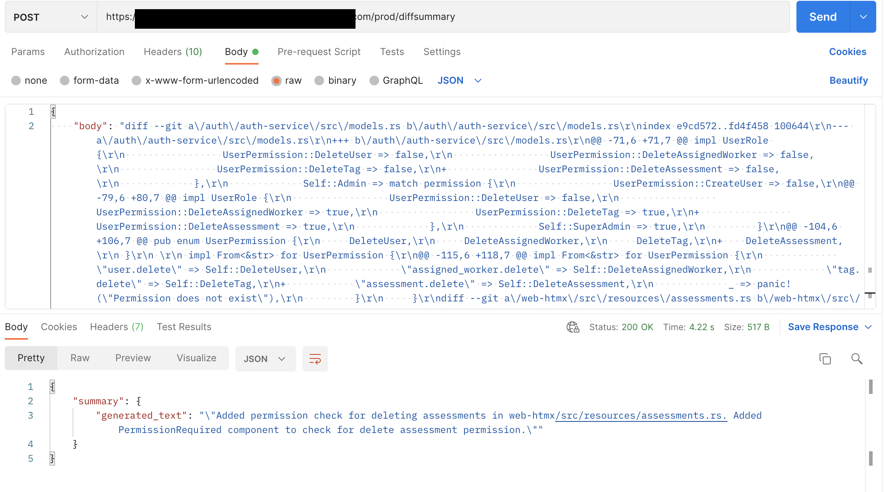

# NonBlocking Code Review with Large Language Models

I've been seeing a lot of really cool ML applications recently and have been particularly impressed with their ability to improve development workflows.

I'm a big fan of Github Copilot auto completions and code generations, and I have been looking to integrate ChatGPT powered tools into my editor and developer flows which has been extremely productive and a lot of fun.

So it seemed like the time to dig deeper into the technology and see if I could make developer tools that solve some other problems I have.

In particular, I have been working on a couple side projects with some friends recently, and we have been experimenting with non-PR based workflows. That is, we all more or less work off of main locally, we have githooks for CI, and we just pair/mob a lot, trust the build system and the tests we write, and generally don't feel the desire to use a PR based system.

Of course, there are lots of holes here to fill because there doesn't appear to be good tooling to support this way of working since PRs are the standard way of working at the moment for a variety of good reasons.

And then I saw this post on LinkedIn:


And I thought that this applied to us and could be a good opportunity to learn some new technologies and make a useful tool for ourselves.

So over the holidays I tried to quickly learn some AI/ML basics and get a prototype of the above application implemented -- with a bias towards learning the new technologies over maybe more *practical* choices like just using the chatgpt API.

## The project

In order to scope this down, I decided to focus on using an ML model for summarizing diffs to then display in a feed -- and stuff like personalization I decided to punt on.

### The plan

First I would need to learn about ML stuff. My previous background included some NLP research in underground a decade ago, and [Andrew Ng's classic Coursera Machine Learning class.](https://www.coursera.org/specializations/machine-learning-introduction) So I knew a bit more than nothing, but I was pretty unfamiliar with the new world and everything that had emerged since the [Attention paper was published.](https://arxiv.org/abs/1706.03762)

So I quickly did this excellent new Coursera class: [Generative AI with Large Language Models](https://www.coursera.org/learn/generative-ai-with-llms/) and I would strongly recommend it! 

After completing the class I threw together a loose high-level plan:

1) Integrate with Github to get webhook events related to changes (this ended up being [Push events](https://docs.github.com/en/webhooks/webhook-events-and-payloads#push)

2) Setup some kind of cool ML magic to summarize diffs in short tweet-like messages.

3) Create a simple view to see those summaries, with the ability to drill into the actual commits if required.

My main goal was to build something useful as quickly as possible -- ideally with it *barely* working, with some wiggle room to be more hands-on with the ML portion, even at the expense of accuracy and efficiency, since that is the stuff I was trying to learn.

It was clear from some experimentation that just using an existing openai/chatgpt api to summarize my diffs was probably easier, cheaper, and better than the models I would deploy, but I wanted to go through the process of selecting a model, playing around with it in a notebook, messing with some simple prompt engineering, and actually deploying the model.

That is to say, ChatGPT seemed already pretty good at doing the exact diff summarization task I wanted, and I could have just used their [provided API](https://help.openai.com/en/collections/3675931-api) to incude this in my app without any additional work. 

As an example, just plugging in this diff in the ChatGPT GUI gives a pretty good result: `https://github.com/tapegram/nonblocking-reviews/compare/6faabbc26aa1...cedddc12dc5b.diff`


But I wanted to take a harder path for learning reasons, so I opted to go with AWS SageMaker Jumpstart, so I could try different models, play with them in a notebook, and then deploy them myself -- as well as leaving the door open for future fine-tuning. Based on the current state of ML tooling, I think you can get a lot of mileage out of just existing APIs for these models like what OpenAI provides, but I'm sure there are other more specific usecases where a company would get value out of refining a more specialized model, so I wanted to try going down that path even if it wasn't strictly necessary for the actual project needs.

By now, my thoughts were to make an app that looked something like this:


### The implementation

#### Bootstrap a simple web application

I have been working a lot recently with Rust and HTMX for webapps, and decided to continue doing that here because I have been enjoying myself. I previously created a simple template repository based on some of my preferences for working in that tech stack and with some opinionated code generation tools (which is another blog post) which made getting started pretty straightforward and I was able to move quickly while still having some separation of concerns in the app (general ports and adapters patterns while still prototyping rapidly).

That being said, I did run into some expected frustration mapping models between layers. The data layer (Mongo records), the application layer, and the github adapter all had similar representations of a "Push," but I modeled them separately to be responsible and allow the app to evolve easier in the future -- but this did slow me down a little bit, maybe adding another hour to the project. This is an extremely low cost to staying agile and being able to continue iterating on this project quickly without dealing with accidental complexity from coupling -- but I definitely felt slowed down by doing this. I had the idea of trying to make a rust macro and/or a code generation tool for generating the mappers and structs for models that start off similar but may diverge in the future -- but decided to add that to my todo list instead of going down a rabbithole here. But I am very keen on making some small tool to allow for generating the boilerplate needed to keep concerns loosely coupled, as this boilerplate is by far the most frustrating aspect of my preferred architecture style and would hopefully eliminate the need to even consider writing highly-coupled code in the name of prototyping rapidly.

#### Github App

I created a simple Github App to handle webhook integrations with Github. I mostly just followed [the github tutorial for this one](https://docs.github.com/en/apps/creating-github-apps/writing-code-for-a-github-app/building-a-github-app-that-responds-to-webhook-events)

In my application, I made a simple webhook handler that gathered any necessary github-specific information in response to a Push event (like fetching the diff from the Github API) and then called into my service to handle the event.

The service would then just persist any relevant information

#### Setup the ML Model

I decided to stick with AWS SageMaker because it was what was used in the Coursera class. Using SageMaker Jumpstart, I tried deploying a few different models and then playing with them in a jupyter notebook, which was an extremely positive experience that let me experiment quickly.

I was slightly limited in what I could try, since many of the models that looked especially promising required large instance sizes than my personal AWS account was approved for. I ended up only seriously trying two models: [Flan-T5](https://huggingface.co/google/flan-t5-xl) and [CodeLlama-7b-instruct](https://huggingface.co/codellama/CodeLlama-7b-Instruct-hf).

The Flan model struggled out of the gate to do anything other than write a main method in Rust with any kind of zero-shot inference, whereas the CodeLlama model immediately had decent results, probably due to being trained more on code than a general-purpose Flan model.

I then spent a couple of hours just fooling around with zero-shot prompts to try to consistently get the kind of response I wanted, using some of the diffs I had already captured in the application.

I ended up with the relatively simple:

```python
instructions = [
        {
            "role": "user",
            "content": f"Write a succinct tweet summarizing this code change: {diff}. Do not include any introductory text in the tweet and do not say 'code change'",
        }
    ]
```

The last bit about not saying "code change" was because the model kept trying to preppend every summary with "Code change: <summary>"

#### Deploy the ML Model as an API

Then I followed this documentation to expose this model via a Lambda and API Gateway: https://aws.amazon.com/blogs/machine-learning/call-an-amazon-sagemaker-model-endpoint-using-amazon-api-gateway-and-aws-lambda/

This was pretty straightforward, and making the lambda was especially easy since I just picked a Python runtime and then mostly copy+pasted my work from the notebook into the lambda.



Then I updated my application webhook handler to also really quickly feed the diff into the model to get a summary!

```rust
// From inside my webhook handler.
// Please excuse all of the expects and sloppiness this is just a poc ;)
match event.kind {
    WebhookEventType::Push => {
        info!("Received a push event {:?}", event);

        let push_event: Box<PushWebhookEventPayload> = match event.specific {
            WebhookEventPayload::Push(push_event) => push_event,
            _ => panic!("Expected push event"),
        };

        let repository: octocrab::models::Repository =
            event.repository.expect("Expected repository");

        // The push event comes with a compare url which we can modify to get the diff.
        let compare_url: String = push_event.as_ref().compare.to_string();
        let diff = reqwest::get(format!("{}.diff", &compare_url))
            .await
            .expect("Failed to get diff of the commit")
            .text()
            .await
            .expect("Failed to get diff of the commit");

        let mut ml_summary_json_body = HashMap::new();
        ml_summary_json_body.insert("body", diff.clone());

        // This is the shape of our Model's API response! Could be better!
        #[derive(Serialize, Deserialize)]
        struct Summary {
            summary: GeneratedText,
        }
        #[derive(Serialize, Deserialize)]
        struct GeneratedText {
            generated_text: String,
        }

        // And now we feed the diff from above into our newly exposed model
        // Note: I think this should step should probably be done inside the service and not the github
        // webhook adapter, so that's something I plan to refactor soon.
        let client = reqwest::Client::new();
        let summary_response: Summary = client
            .post("https://myhash.execute-api.us-east-1.amazonaws.com/prod/diffsummary")
            .json(&ml_summary_json_body)
            .header("x-api-key", ml_api_key)
            .send()
            .await
            .expect("Failed to get summary of the commit")
            .json()
            .await
            .expect("Failed to get body of the summary response");

        // And then we give all our cool values to the service for handling
        review_stream_service
            .handle_github_push(HandleGithubPushInput {
                github_event: *push_event,
                repository,
                diff,
                summary: summary_response.summary.generated_text,
            })
            .await
            .expect("Failed to handle push webhook")
    }
    _ => warn!("Ignoring event {:?}", event),
};
```

I think most of this process should probably be async and queue-based, which is something I might do after I deploy this service and start using it as a tool with my real work. That would also allow for more fine-grained data processing and maybe a more interesting data model where we could organize the data in a way that allows for better personalization.

#### Presenting this information as a view

I'm hand-waving this a bit but the service has two commands at the moment:

1) `handle_github_push` which maps the data to our preferred format and stores it, and

2) `get_feed` which returns a "feed" which we can then render.

I made a simple view for this using [rscx](https://github.com/pitasi/rscx) plus some cool reusable components we have been building out in another rust project (like form, grid, and table components).

```rust
// Some routes we wire up with the main app elsewhere.
pub fn feed_routes(state: WebHtmxState) -> Router {
    Router::new()
        .route(routes::FEED, get(get_feed))
        .with_state(state)
}

// Our handler for the `/feed` route.
async fn get_feed(State(state): State<WebHtmxState>) -> impl IntoResponse {
    // Fetch the feed from the service.
    // NOTE: we probably want to map this to a view model to avoid coupling between layers here. That is another follow up as 
    // we productionize this.
    // SECOND NOTE: I'm using a code generator to create all the scaffolding around service commands, and it defaults to
    // generating input structs instead of multiple arguements for a service call. This doesn't take any input yet so I'm passing
    // in an empty struct, but it should probably either take no arguments at all, or I should add a real arguement. This is probably
    // where some identity token should be passed in so we can get a personalized feed.
    let feed = state.review_feed_service.get_feed(GetFeedInput {}).await.expect("Failed to get feed");

    let content: String = feed
        .items
        .iter()
        .map(|item| async {
            html! {
                <GridCell>
                    <Card class="m-4 p-4">
                        <a href={ item.link.clone() } class="text-2xl">
                            <p class="m-2">@{ item.author.clone() }</p>
                            <p class="m-2">{ item.summary.clone() }</p>
                        </a>
                    </Card>
                </GridCell>
            }
        })
        .collect_fragment_async()
        .await;

    Html(html! {
        <PageLayout>
            <PageContent title="Code Feed">
                <GridLayout>
                    {content}
                </GridLayout>
            </PageContent>
        </PageLayout>
    })
}
```

And this looks like


Pretty neat!

## Result

I got to make a simple web app to collect Github push events, use some ML magic to summarize the changes based on a diff, and then create a simple "code review" feed that can be used to keep up to date with changes as they happen!

Clicking any of the above summaries takes you directly to the commit so you can drill down if you think it is relevant.

This is a very exciting start and I have a ton of ideas to try next to push forward on it. I'm thinking of getting this slightly more "production ready" which should be a few small changes, and getting it deployed for me and some friends to use on a project together.

By dogfooding it, I hope we can identify the high-value areas to improve and get iterating on it.

Some ideas that we may end up trying are:

1) Further refining the summarization model with one or few shot inference

2) Building data collection into the feed so we can generate training data we can later use to fine-tune our model in SageMaker

3) Using a different model to generate "better" summaries that we can then use for fine-tuning. For example, we could use the openai/chatgpt API to generate summaries for our diffs and then use that as the training set for our CodeLlama model.

4) Setting up another model for personalization: can we update the feed to only show events that the user will be interested in? And even better, could we have the model explain why it might be interesting to the user. E.g. "You changed this code recently" or "This change is large enough that you may want to be aware of it" or "Someone you work closely with is making these changes."

5) Experiment with making the model a program-aided model and allow it to look up user and commit information to better inform summaries and personalization.

6) Or even just add some simple non-ML rules to the system. Like "show this to a user if they have a recent commit in a file" or "show this if the diff if larger that x lines." Or we could identity these as indicators that we also feed to the summarization model so it has more context than the diff when generating a more personalized summary.

## Conclusion

It's cool how far NLP and ML have come. I'm especially excited about how accessible and how much good tooling exists for this stuff now. I was able to get this out the door despite knowing little about it and during the holidays in between family events, dinners, friends visiting, etc -- which is a great testament to the quality of tooling and efforts of the community to make ML accessable.

I've only barely dipped my toes in, but it's cool to have gotten to go through the process (albeit without fine-tuning -- yet!).

## The Code

This repo lives here: https://github.com/tapegram/nonblocking-reviews (though you won't be able to run it locally without all the various webhook secrets)
