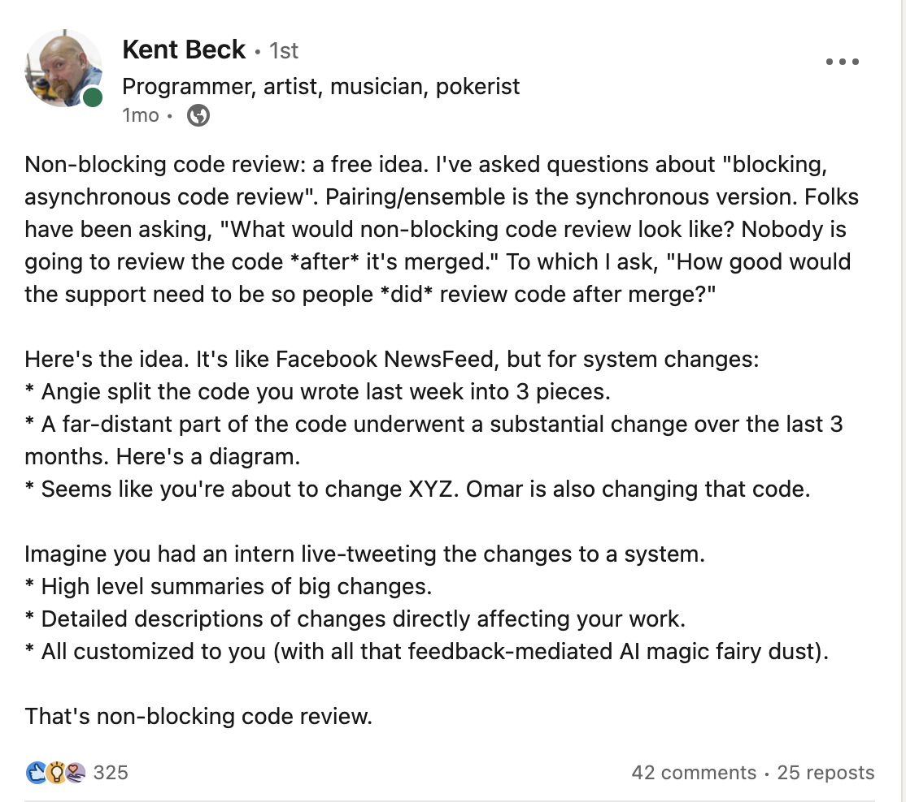

# Holiday ML Project

Over the holidays I decided I wanted to do two things:

* Get started learning some of the cool AI/ML stuff going on
* Read a book about auth and identity

The latter was boring so I neglected it in favor of working on a fun little project. 

## The project



Kent Beck posted this on LinkedIn a bit ago and I thought it sounded like a really cool idea. I have also been growing increasingly suspicious of the PR process in general, and have been working without PRs with some friends on a separate project (which I hope to post about later, there is some very cool rust/htmx stuff going on there, along with code generation tooling for productivity)

So this appealed to me -- it could be something I would want to use every day.

### The plan

First I would need to learn about ML stuff. I had previously done *The ML Class* that everyone does on Coursera, and I did a little bit of NLP research back in college, but other than that I was pretty thin on what this work would entail.

So I quickly did this excellent new Coursera class on LLMs/ML: [Generative AI with Large Language Models](https://www.coursera.org/learn/generative-ai-with-llms/)

The high-level plan was:

1) Integrate with Github to get webhook events related to changes (this ended up being Push events)

2) Setup some kind of cool ML magic to summarize diffs in short tweet-like messages.

3) Create a simple view to see those summaries, with the ability to drill into the actual commits if required.

This was my outline for a very simple MVP. My main goal was to build something useful as quickly as possible, with some wiggle room to be more hands-on with the ML portion, even at the expense of accuracy and efficiency, since that is the stuff I was trying to learn.

It was clear from some experimentation that just using an existing openai/chatgpt api to summarize my diffs was probably easier, cheaper, and better than the models I would deploy, but I wanted to go through the process.

For instance, by asking chatgpt to summarize this diff: https://github.com/tapegram/nonblocking-reviews/compare/6faabbc26aa1...cedddc12dc5b.diff I was able to get a summary I was pretty happy with:


This felt like it would already be useful to me, and would leave open the possibility of further refining the summarizing and introducing other ML applications, like personalization.

### The implementation

Once the class was done, it was time to get to work

#### Bootstrap a simple web application

I created a simple template repository from the above mentioned htmx/rust project and used that to bootstrap a new simple web app.

I just felt like continuing to use htmx and rust since I had grown comfortable using them for other projects recently.

#### Github App

I created a simple Github App to handle webhook integrations with Github. I mostly just followed [the github tutorial for this one](https://docs.github.com/en/apps/creating-github-apps/writing-code-for-a-github-app/building-a-github-app-that-responds-to-webhook-events)

In my application, I made a simple webhook handler that gathered any necessary github-specific information in response to a Push event (like fetching the diff from the Github API) and then called into my service to handle the event.

The service would then just persist any relevant information

#### Setup the ML Model

I decided to stick with AWS SageMaker purely because it was what was used in the Coursera class. Using SageMaker Jumpstart I tried deploying a few different models and then playing with them in a jupyter notebook, which was an extremely positive experience that let me experiment quickly.

I tried a flan model which ended up giving me pretty poor results. AWS limited my options a bit since the bigger more expensive models weren't allowed to be deployed without contacting AWS to give me access, which is fair enough I don't want to accidentally spend a billion dollars on this side project.

After a couple of tries I found [CodeLlama-7b-instruct](https://studio-d-esnt37a3pxef.studio.us-east-1.sagemaker.aws/jumpstart/meta/meta-textgeneration-llama-codellama-7b-instruct) had pretty good out-of-the-box support for the diff summarization I wanted. Not as good as chat gpt, but more than good enough!

I then spent a couple of hours just fooling around with zero-shot prompts to try to consistently get the kind of response I wanted, using some of the diffs I had already captured in the application.

I ended up with the relatively simple:

```python
instructions = [
        {
            "role": "user",
            "content": f"Write a succinct tweet summarizing this code change: {diff}. Do not include any introductory text in the tweet and do not say 'code change'",
        }
    ]
```

#### Deploy the ML Model as an API

Then I followed this documentation to expose this model via a Lambda and API Gateway: https://aws.amazon.com/blogs/machine-learning/call-an-amazon-sagemaker-model-endpoint-using-amazon-api-gateway-and-aws-lambda/

This was pretty straightforward, and making the lambda was especially easy since I just picked a Python runtime and then mostly copy+pasted my work from the notebook into the lambda.

I threw an API Key requirement on it to pretend it was secure and voila I had a ML diff summarizing endpoint!


Then I updated my application webhook handler to also really quickly feed the diff into the model to get a summary!

```rust
// From inside my webhook handler.
// Please excuse all of the expects and sloppiness this is just a poc ;)
match event.kind {
    WebhookEventType::Push => {
        info!("Received a push event {:?}", event);

        let push_event: Box<PushWebhookEventPayload> = match event.specific {
            WebhookEventPayload::Push(push_event) => push_event,
            _ => panic!("Expected push event"),
        };

        let repository: octocrab::models::Repository =
            event.repository.expect("Expected repository");

        // The push event comes with a compare url which we can modify to get the diff.
        let compare_url: String = push_event.as_ref().compare.to_string();
        let diff = reqwest::get(format!("{}.diff", &compare_url))
            .await
            .expect("Failed to get diff of the commit")
            .text()
            .await
            .expect("Failed to get diff of the commit");

        let mut ml_summary_json_body = HashMap::new();
        ml_summary_json_body.insert("body", diff.clone());

        // This is the shape of our Model's API response! Could be better!
        #[derive(Serialize, Deserialize)]
        struct Summary {
            summary: GeneratedText,
        }
        #[derive(Serialize, Deserialize)]
        struct GeneratedText {
            generated_text: String,
        }

        // And now we feed the diff from above into our newly exposed model
        let client = reqwest::Client::new();
        let summary_response: Summary = client
            .post("https://myhash.execute-api.us-east-1.amazonaws.com/prod/diffsummary")
            .json(&ml_summary_json_body)
            .header("x-api-key", ml_api_key)
            .send()
            .await
            .expect("Failed to get summary of the commit")
            .json()
            .await
            .expect("Failed to get body of the summary response");

        // And then we give all our cool values to the service for handling
        review_stream_service
            .handle_github_push(HandleGithubPushInput {
                github_event: *push_event,
                repository,
                diff,
                summary: summary_response.summary.generated_text,
            })
            .await
            .expect("Failed to handle push webhook")
    }
    _ => warn!("Ignoring event {:?}", event),
};
```

The above code has a lot of room for improvement so please don't focus too much on that. I also think most of this process should probably be async and queue-based, which is something I might do after I deploy this service and start using it as a tool with my real work.

#### Presenting this information as a view

I'm hand-waving this a bit but the service has two commands at the moment:

1) `handle_github_push` which maps the data to our preferred format and stores it, and

2) `get_feed` which returns a "feed" which we can then render.

I made a simple view in like 5 minutes for this (so again, please withhold your criticisms regarding the many lazy bits here)

```rust
pub fn feed_routes(state: WebHtmxState) -> Router {
    Router::new()
        .route(routes::FEED, get(get_feed))
        .with_state(state)
}

async fn get_feed(State(state): State<WebHtmxState>) -> impl IntoResponse {
    let feed = state.review_feed_service.get_feed(GetFeedInput {}).await.expect("Failed to get feed");

    let content: String = feed
        .items
        .iter()
        .map(|item| async {
            html! {
                <GridCell>
                    <Card class="m-4 p-4">
                        <a href={ item.link.clone() } class="text-2xl">
                            <p class="m-2">@{ item.author.clone() }</p>
                            <p class="m-2">{ item.summary.clone() }</p>
                        </a>
                    </Card>
                </GridCell>
            }
        })
        .collect_fragment_async()
        .await;

    Html(html! {
        <PageLayout>
            <PageContent title="Code Feed">
                <GridLayout>
                    {content}
                </GridLayout>
            </PageContent>
        </PageLayout>
    })
}
```

And this looks like


Which is pretty neat, in my opinion!

## Result

I got to make a simple web app to collect Github push events, use some ML magic to summarize the changes based on a diff, and then create a simple "code review" feed that can be used to keep up to date with changes as they happen!

Clicking any of the above summaries takes you directly to the commit so you can drill down if you think it is relevant.

This is a very exciting start and I have a ton of ideas to try next to push forward on it. I'm thinking of getting this slightly more "production ready" which should be a few small changes, and getting it deployed for me and some friends to use on a project together.

By dogfooding it, I hope we can identify the high-value areas to improve and just to get iterating on it.

Some ideas that we may end up trying are:

1) Further refining the summarization model with one or few shot inference

2) Building data collection into the feed so we can generate training data we can later use to fine-tune our model in SageMaker

3) Using a different model to generate "better" summaries that we can then use for fine-tuning. For example, we could use the openai/chatgpt API to generate summaries for our diffs and then use that as the training set for our CodeLlama model.

4) Setting up another model for personalization: can we update the feed to only show events that the user will be interested in? And even better, could we have the model explain why it might be interesting to the user. E.g. "You changed this code recently" or "This change is large enough that you may want to be aware of it" or "Someone you work closely with is making these changes."

5) Experiment with making the model a program-aided model and allow it to look up user and commit information to better inform summaries and personalization.

## Conclusion

It's cool how far NLP and ML have come. I'm especially excited about how accessible and how much good tooling exists for this stuff now. I was able to get this out the door from basically scratch during the holidays in between family events, dinners, friends visiting, etc -- which is a great testament to the ease one can ramp up on this stuff.

I've only barely dipped my toes in, but it's cool to have gotten to go through the process (albeit without fine-tuning -- yet!).

## The Code

This repo lives here: https://github.com/tapegram/nonblocking-reviews (though you won't be able to run it locally without all the various webhook secrets)
