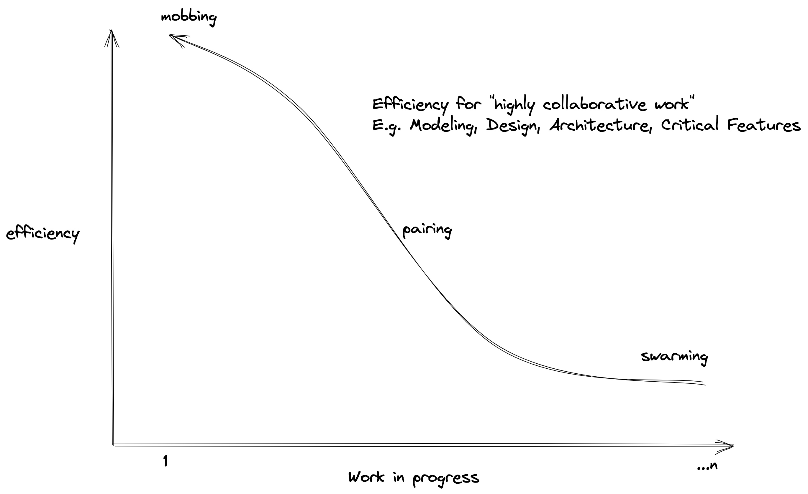
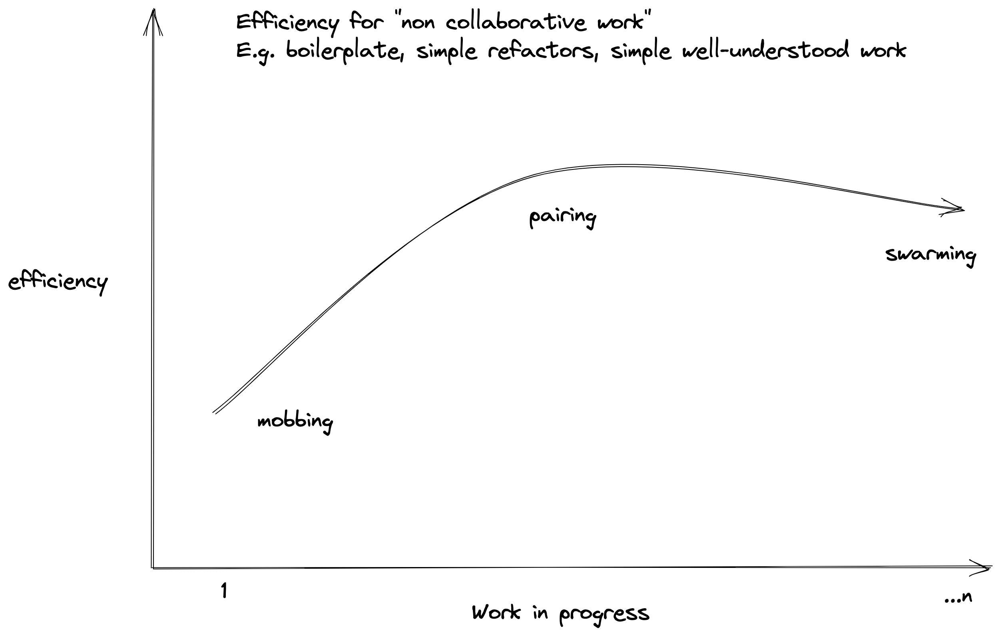

# Swarming, Pairing, and Mobbing (the spectrum of team-based collaboration)

## Intro 
By default, it seems that most people's experience of programming is done individually. A team gets together, tickets are handed out to individuals, they disappear to go heads down to implement the ticket, they come back with a code review, and eventually, the code review is approved, then on to the next ticket.

However, there are also a lot of teams that practice pair programming, like in XP shops like Thoughtworks or Stride. Some even claim that [pair programming is outright superior to the previously described "solo" work](https://www.amazon.com/Extreme-Programming-Explained-Embrace-Change/dp/0321278658) (which I will call 'swarming' when used in a team context).

There are even more extreme XPers like [Woody Zuill who advocate for "mob programming" where the entire team works together at once.](https://www.youtube.com/watch?v=SHOVVnRB4h0)

I want to answer the question: Which is the best option? 

Spoiler: There is no best option overall, but each option has strengths and weaknesses that are situationally appropriate. I would suggest that any team would benefit from learning how to identify when one strategy is better than another and flexibly applying them to their work.

## Swarming

The "traditional" way of working. The most commonly done, the one everyone seems to default to, and the one most maligned by the engineering community. There are a lot of negatives about working this way, but there are times when I believe it is a good choice!

### Drawbacks

Swarming is the least collaborative way you can approach work as a software engineer. The best way to describe this I think is just to list a bunch of scenarios that I imagine are familiar to most people:

- A junior engineer picks up a ticket and disappears for too long to work on it. When they emerge they excitedly share out a monstrous, disaster of a PR that destroys all the architecture in the codebase, would be untestable and unmaintainable, and probably violates international law. They are devastated when you tell them to delete the entire PR and start over (if you don't end up needing to take the ticket yourself). Just the process of reading the PR and understanding it wastes a lot of the senior's time. Everyone is frustrated. The junior engineer learns a little bit through the process though! But the learning is framed very negatively (You worked hard and we hated it). No one else learns anything. Very inefficient use of time. This is the most common way I've seen people work themselves out of a job, unfortunately.

- A senior engineer picks up a ticket and disappears for too long to work on it. They emerge with something with an enormous amount of scope creep. They ran into a small problem and decided they could fix it along the way. This happens several more times, and before you know it the PR is huge and does a bunch of different stuff. The PR review process is very long since someone needs to relearn after the fact all the tradeoffs the author went through to even understand what's going on (why is any of this here I thought it was just a copy change???) There is a tendency to pull in low-priority work along with the high-priority focus of the ticket, so this is also an inefficient use of dev time. Because the dev put in so much work (and it's not _wrong_* per se) there is a lot of pressure to approve the PR and to include all the scope creep. The senior engineer learns a good amount, the reviewers learn a little (maybe I'm sharing my own experience a bit too much here, but I don't learn very much from reviewing other people's PRs, regardless of the effort spent to understand the PR), no one else learns anything. Overall, not a very efficient use of everyone's time.

- A senior engineer picks up a ticket and disappears for the exact appropriate amount of time to implement the ticket. The ticket has no scope creep. The reviewer then needs to reverse engineer all of the decisions that led to the PR before approving (or just pretend they did and hit approve). This is very efficient from the perspective of the author since they cranked out some work, but they probably didn't learn much as they seemed to have already known how to implement everything, and the reviewer didn't learn much from reviewing. This is more efficient in terms of effort to velocity in the short term than the above scenarios, but no one grew or learned anything -- so these just further silos work with the author of this PR. The team / junior engineers didn't get the chance to improve much.

- A senior engineer picks up a ticket and disappears for a reasonable amount of time. When they come back, they have an implementation, but also several alternative ideas for the implementation, without a clear idea about which would be the best one. The PR is the first time they would get feedback on the different ideas. This is also inefficient due to the late feedback/discussion (as opposed to pair/mobbing where you get feedback continuously)

Overall, individual work like swarming is usually 
- inefficient due to the handoff for the code review
- those with the biggest learning opportunity end up risking huge waste in chasing the wrong implementation, scope creep, etc.
- less disciplined engineers are strongly tempted to go down rabbit holes instead of staying focused on the high-value aspects of the tickets (again, efficiency)
- efficient work in this style tends to imply a lack of learning
- the minimum number of people involved in doing the work which can contribute to heavy siloing of knowledge

There is a caveat here where a lot of these issues can be mitigated with outstanding engineering discipline, effort, and expertise (aka Hero work). If some absolute legend is constantly checking in with junior engineers to make sure they aren't spinning their wheels too long on anything and giving them quiet and helpful feedback for their PRs if senior engineers are perfectly able to identify when they should abandon work and pull the team into a conversation before continuing to code, or if engineers are experts at focusing on the high-value aspects of the tickets (while paradoxically, capable of judging when a situation has changed and the ticket is no longer high value to warrant its priority), etc.

The above is all good stuff to strive for, but it is _hard_ to do in this paradigm, whereas it is _easier_ to do in pairing and the _natural default_ in mobbing.

### Benefits

- *IF* (read: "big if") you can manage the drawbacks above, this allows you to parallelize tasks in such a way that you can increase your team's velocity. Again, that is if you can manage the drawbacks like siloing, inefficiency, etc. that normally lead to parallelizing work like this being slower than pairing or even mobbing.

- Working on something by yourself is very inefficient but you do undoubtedly learn a lot from the struggle. Additionally, what you learn in this way is different than what you get when you are taught something. [Marvin Minksy used the phrase "Hard Fun" when describing childhood learning with difficult games or activities (like tinker toys).](https://mitpress.mit.edu/9780262039093/inventive-minds/) He also talks about expertise being the collection of ["negative" knowledge](https://web.media.mit.edu/~minsky/papers/NegExp.mss.txt) (i.e. internalizing what _not to do_ over _what to do_). I think these two ideas combined best describe the benefits an individual gets when suffering through some new piece of work by themselves. In my opinion, for a team to grow strong engineers optimally, it must provide opportunities to learn by being _taught_ and to learn through _experience_. More on that a bit later though.

### When to do it

Swarming or solo works seems most appropriate for work that 

- Is well understood by the team as a whole, so there isn't a lot of learning to be done and little benefit from involving multiple people. For example: implementing a bunch of new emails from a spreadsheet when a well-established framework or pattern exists in the codebase. That might benefit everyone on the team by just picking up one or two tickets so the team as a whole can get it done as fast as possible.

- Is tedious, such as requiring lots of trial and error instead of discussion and design. Someone could work on this and then report back to the team with the learnings. Examples include doing changes like renaming some types across the whole codebase, some pre-agreed upon structural refactoring to the codebase, or debugging some weird low-level issue (test flakiness, intermittent OOM errors when running the tests locally, stuff like that where you just have to sit and suffer until it works).

- Some exploratory work: such as trying your hand at something to build a POC or just getting a sense of a new pattern, paradigm or technology, before bringing it to the team for everyone to try.

- If you just feel like it because you've been doing a lot of pairing and mobbing and just want to go heads down on something for a bit, even though you know it's less efficient. That's ok sometimes! Though it's probably better that it's the exception rather than the rule.

## Pairing 

Because Pairing and Mobbing have more benefits than drawbacks, in my opinion, I'll start with benefits going forward.

### Benefits

In general, pairing is more efficient than solo work.

- Less chance to fall down rabbit holes since you are working with another person. I can't tell you how many times I've started to get off track except for the person I'm pairing with who will just say "let's worry about that later." It's really easy to stray from the main point of your work by yourself, but it's even easier to keep someone else focused when you are working with them and seeing them start to veer off course.

- Less decision latency: you can immediately discuss every decision you make as you are writing the code with the other person, no need to post in slack and wait for someone to see it and choose to involve themselves or worst case implement the whole thing and then get design feedback on the PR.

- Less siloing: instead of one person getting all the learning from working through the PR, two people get all the learning!

- More efficient PRs: Instead of needing to convince someone to review the PR and revisit/understand your design decisions, you get a "continuous" code review from the person you are pairing with! Instant PR approval!

- Can be leveraged to help with learning: instead of sending a junior engineer off to teach themselves how to do something by themselves, you can pair with them to teach them by guiding them through it. Additionally, the more senior engineer of the pair is forced to explain their ideas and thoughts in ways that may force them to better understand, refine, or even challenge their ideas.

- Reduces corner-cutting by social pressure: I may be telling on myself here but if I'm doing solo work, it's a lot easier for me to cut a corner or be a little sloppy because I'm starting to feel like I want to get something done sooner. But when I'm working with someone else, I know I'll need to justify it or I'll get called out for it, so I'm usually on my best behavior.

Overall, pairing is _usually_ more efficient for getting quality work done since it minimizes handoffs, reduces decision latency, shortens feedback loops, improves quality, and reduces silos (by 1)

### Drawbacks

Pairing is a discipline and a skill so as a result it can be done "well" or "poorly" and this can affect the degree of the benefits you can get from it.

For example,

- I might hog all the driving or refuse to drive outright in the wrong context. For example, if I'm the senior engineer teaching a junior engineer, it's probably best to encourage them to drive more so they can get as much engagement and hands-on experience as possible with me guiding them. If I insist on driving the whole time, it will be hard for them to stay engaged. If we are both similarly experienced engineers bouncing ideas off of each other, it may start to be a struggle to stay in the navigator role for long periods, especially if the driver takes over both roles and just starts doing everything without any room for discussion. That's just swarming but wasting an extra person's time.

- Pairing does require some degree of empathy and social awareness. You can't just dump on the other person's ideas or reject everything out of hand. You have to intentionally build rapport with your teammates and pairing partners and intentionally make pairing a fun and productive experience for everyone. One of my favorite pages in XP Explained has a paragraph dedicated to making sure that if you are pairing, you are showering and respecting people's personal space. It matters!

- Despite reducing siloing, it only does it by 1 person. And we still can have decision latency when it comes to non-engineering roles, like PMs, managers, or other areas of expertise necessary to make good software.

- You might need to encourage people to not just partner up with the same people time after time, as they can worsen siloing significantly and could even turn into outright ostracization if someone notices that no one wants to pair with them. Pair programming is a social activity and therefore is at bigger risk for social problems. Hiring and team culture become more and more important if your team has to *collaborate* every day (GASP).

### When to use it

In general, I would suggest pair programming as a great "default" for how to work with most teams. You get a ton of benefits with a minimal amount of downsides (most of which are "learning how to pair", which is done through practice).

Additionally, pairing can still result in siloing knowledge if not intentionally managed, like it swarming. Just with pairs instead of individuals.

I would suggest pairing or mobbing depending on how important minimizing siloing is to your team, as well as how much of your work is design based, or how much of your work is bottlenecked based on decision latency. The more *collaboration* required, the more pairing and mobbing benefits you.

Pairing is also excellent for onboarding engineers, as you can pull them directly into normal day-to-day work, let them drive the majority of the time, but minimize the amount of "waste" by having the navigator guide the work. In my experience, doing something like this helps people onboard a lot faster than just sending them off to work on "onboarding" tickets.

On the other hand, pairing and mobbing even more so are disciplines than can be done poorly, so you may want to ramp up pairing gradually (and then continue to ramp up mobbing later if it seems natural).

As mentioned in the section on when to swarm, those may be times you would opt out of pairing or mobbing as well.

## Mobbing

Mobbing is more or less pairing with more people (e.i. taking pairing to the extreme!) So benefits and drawbacks will look similar, but with some additional nuances involving discipline and involving nontraditional roles in the implementation process.

### Benefits

Similar to pairing but *more*.

- No siloing because the entire team is there, so everyone takes part in the discussions and the decisions and can stay abreast of all the work being done.

- Prioritization becomes easier because if the team's WIP is approach 1, that should always be "the most important thing." You won't always get this right, but the process of mobbing strongly encourages that the team is always working on The Most Important Thing.

- Similarly, mobbing strongly discourages increasing scope or falling down rabbit holes. The whole team is there to keep the work focused and on track. Even better, with the whole team there, priorities can pivot immediately and correctly based on the full team's input when something new is discovered via that work in progress. Especially, if you manage to get your PO or onsite customer in the mob.

- Quality in your work is likely to end up being as good as it can be because the whole team is involved in designing and delivering the work continuously. It's like every team member is signing off on every PR but better. This also helps with efficiency because there will be fewer bugs, UAT issues, etc. that will come back to the team to interrupt them.

- Decision latency and handoffs are eliminated (if they are decisions and handoffs within the team). Any problem that can be handled by _someone_ in the team, can be handled immediately in the mob. Absolute efficiency!

- Fewer "meetings" are needed, because, like in the above case, anything that can be handled by someone in the team can be handled ad hoc in the mob.

- It's fun and social! Maybe this isn't a positive for everyone, but I find this to be the *most fun way to work*. Lots of joking around and having fun and still being productive!

### Drawbacks

Like with pairing but even more so: mobbing is a discipline and a skill that the team will need to get good at. 

It has all the social problems that pairing has but MORE SO. It's easy for someone who isn't confident to get lost in the mob and hide in the number -- not engaging and as a result not learning or helping others learn. It's also even more important to consider other people when you are in the mob. An example of this can be seen in some of the mobbing talks and posts seen online that recommend talking in a declarative instead of an imperative way: don't just tell people to do things, state instead what you are thinking or how you feel about stuff. It's easy to rub people the wrong way if you are talking over other people or are perceived as ordering people around, so the team as a whole needs to learn how to communicate effectively with each other in a sustainable way. A lot of "I feel like we should try X because Y" or "I am not as much a fan of that choice because Z" instead of "Do X" or "don't do Z" or "delete that and never do it again, you detestable fool."

There can be a lot of organizational suspicion of a team doing "1 thing at a time" when they could be doing "n things at a time." Though it ends up being more efficient (anecdotally, from my experience) it may seem counterintuitive to people who have not experienced all of these different ways of working and their different tradeoffs.

Additionally, I have seen issues with some teams where they love mob programming so much they NEVER WORK ANOTHER WAY, which in some ways warms my heart because I think mobbing is _often_ the best way to work, there are times when pairing or swarming or something in between might be better for any of the previously mentioned reasons. Mobbing is an excellent tool in the team's toolbox, which often can and should be the default way of working, but it should not be the _only_ way the team works.

It can also be difficult to get the full benefit of mobbing because individuals may not be able to consistently make it to the mob together. For instance, the mob benefits a lot from having a PO present, but in my experience, they are usually too busy to be there all the time. However, POs often quickly see the value of mobs and make time to show up to the mob when asked, because it ends up being the most efficient use of their time as well.

Mobbing might also be logistically difficult for other reasons, like the team is too big, or too distributed amongst timezones for there to be enough good shared time together, or if you are working in person together, you need a dedicated room and equipment. 

### When to use it

Mobbing is like pairing in that I think the positives strongly outway the negatives in most cases. You will likely want to do mobbing for the same reason as pairing but you want to double down on those same benefits. I would suggest mobbing on whatever the team considers important. The more important the work, the more people should be involved and the more efficient the work should be!

If the work is foundational or critical to the team, you should want to maximize learning and minimize siloing, so mob on it!

If the work is heavily design or discussion based, you can make it much more efficient by bringing in everyone!

If the team "isn't good at mobbing" yet, maybe limit the amount of time you do it and discuss in retros how to improve the mobbing experience for everyone. Maybe it involves being more conscientious towards each other or introducing timers to limit people's driving time, or conversations on the side to encourage teammates to speak up because their opinions are important, even if they are very junior or new.

## Takeaways

The main point of this article is to say that swarming, pairing, and mobbing live on a spectrum with different tradeoffs, and different teams may have different degrees of competency with these paradigms, and they may have work that benefits the workstyle at different ends of this spectrum at any given time.

Additionally, there is a middle ground between mobbing and pairing! Experiment and find what works for you!

In my opinion, most teams should find a home or _default_ that's on the pairing and mobbing side of the spectrum, but remember that swarming is important sometimes too and can have real benefits over mobbing or pairing when applied _appropriately_.

Peep these _highly scientific charts_

These graphs are big generalizations so again, they don't apply in _every_ case, but hopefully, they help a little bit in visualizing some of these thoughts.

Note that for non-collaborative work, I still valued its efficiency over swarming because of eliminating the code review handoff and other bits of process efficiencies, but that varies from organization to organization (and team to team, process to process, feature to feature, etc.)

## Learning Through Teaching and Experience (Suffering)

A problem I have with learning software engineering, in general, is reconciling that it is often faster and better for the team to teach something (like SOLID principles and the like), how to balance coupling/cohesion, patterns, etc. But it can be hard for a junior engineer to internalize or master these concepts without experiencing the problems that these things help us avoid.

That is, it might be hard to get someone to really truly understand the importance of identifying and applying the appropriate measure of loose coupling and cohesion in the code base if they haven't had to live through the suffering of working in a big ball of mud architecture.

I don't want to say that people must suffer to learn, but I'm increasingly convinced that becoming an "expert" can't be done purely through memorizing patterns, principles, and values. You have to experience their application, and possibly, more importantly, their lack of application.

That isn't to say you have to experience EVERYTHING, I'm just not sure what the right amount of balance is. I'm also sure many experiences generalize and complement "taught" knowledge.

Mistakes will be made in mobbing and pairing sessions as well, or even things that aren't mistakes can age poorly if the circumstances in which the decisions were made changes... which it tends to do. So there should be lots of opportunities to experience these engineering problems if you stick around long enough.

This is not a well-articulated thought, but in summary, I believe that even though swarming is incredibly inefficient and should be applied sparingly and situationally, it does offer more of an opportunity to collect the "experiences" of different problems that we discuss (and avoid) more academically in a pair and mobbing atmosphere.

Failure is hard-won knowledge!

## Getting Started with Pairing or Mobbing

In my experience, the best way to get your team going with these paradigms is to work through retros and gradually ramp up the amount of time spent pairing or mobbing based on the response you get.

See [this post on retros](https://github.com/tapegram/blog/tree/main/blog/on_retros) for examples of how that can work.

In particular, for mobbing, I would recommend floating the idea with the team and then scheduling an ad hoc time block to "try out" mobbing on something for an hour or two. If the team enjoys it maybe schedule another one later in the week. If the team continues to have positive feedback when asked, consider bringing up scheduling a recurring time for mobbing on everyone's calendars, maybe once or twice a week. And then adjust from there. In my experience, teams tend to quickly ramp up to mobbing for some amount of time every day, and it quickly becomes the primary driver of work.

#1 thing to keep in mind is not to force it. You can nudge the team towards it by asking about it, but the team should be asking you for more mobbing. Otherwise, it won't stick.

## Some additional resources

[Remote Mob Programming](https://www.remotemobprogramming.org/)

[Rob Martin - Teaching functional programming to noobs (Lambda Days 2016)](https://www.youtube.com/watch?v=bmFKEewRRQg)